# ⚔️ FitQuest
## Group Fitness Challenge & Gamified Social Platform

<p align="center">
  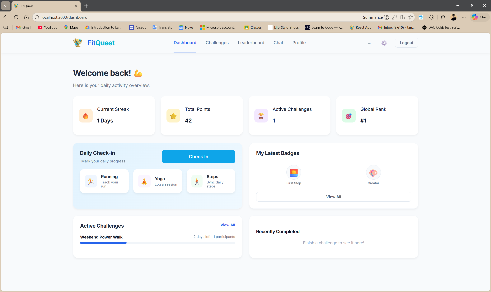
</p>

FitQuest is a full-stack gamified fitness platform built using **React, Spring Boot, and MySQL**.  
It transforms fitness activities into engaging challenges with streak tracking, leaderboards, and social interaction.

FitQuest demonstrates real-world system design, scalable backend architecture, and database modeling using Hibernate ORM.

---

## 🧠 Problem Statement

Most fitness applications focus only on tracking workouts, not motivation.  
FitQuest introduces gamification and social competition to help users stay consistent with their fitness goals.

---

## 🚀 Key Features

### 👤 User Management
- User registration and authentication
- Secure login and profile management

### 🏃 Challenge System
- Create individual and group challenges
- Join ongoing challenges
- Daily activity check-ins
- Streak tracking logic

### 🏆 Gamification
- Leaderboards and ranking system
- Achievement badges
- Consistency scoring

### 📊 Progress Tracking
- Dashboard-based visualization
- Activity history and streak insights

### 💬 Social Features
- Group chats for challenges
- Community interaction

---

## 🏗️ System Architecture

```
Frontend (React)
        ↓ REST API
Backend (Spring Boot)
        ↓ Hibernate ORM
Database (MySQL)
```

### Backend Layered Architecture

```
Controller Layer → Handles HTTP requests
Service Layer    → Business logic (streaks, rankings)
Repository Layer → Database operations
Model Layer      → JPA Entities
```

---

## 🛠️ Tech Stack

### Frontend
- React.js
- JavaScript (ES6+)
- HTML5, CSS3

### Backend
- Java (Spring Boot)
- RESTful APIs
- Hibernate ORM (JPA)

### Database
- MySQL

### Tools & Practices
- Git & GitHub
- Postman
- Layered architecture
- REST API design

---

## 🗄️ Database Setup (MySQL + Hibernate ORM)

FitQuest uses **Hibernate ORM with Spring Boot**.  
You only need to create the database manually.  
All tables are automatically generated by Hibernate.

### Step 1: Create Database

```sql
CREATE DATABASE fitquest;
```

### Step 2: Configure Database in `application.properties`

```properties
spring.datasource.url=jdbc:mysql://localhost:3306/fitquest
spring.datasource.username=root
spring.datasource.password=your_password

spring.jpa.hibernate.ddl-auto=update
spring.jpa.show-sql=true
spring.jpa.properties.hibernate.dialect=org.hibernate.dialect.MySQL8Dialect
```

### Step 3: Run Backend

Once the Spring Boot application starts, Hibernate will automatically create all required tables.

---

## 🔥 Core Logic

### Streak Calculation

```
if (today_completed) {
    if (yesterday_completed) {
        streak++;
    } else {
        streak = 1;
    }
} else {
    streak = 0;
}
```

### Leaderboard Score Example

```
score = (streak * 10) + (totalActivities * 2)
```

Users are ranked based on score in descending order.

---

## 📂 Project Structure

```
FitQuest/
│
├── backend/              # Spring Boot backend
├── Frontend/             # React frontend
├── screenshots/          # UI screenshots
├── README.md
└── .gitignore
```

---

## 🖼️ Application Screenshots

### 🔐 Login
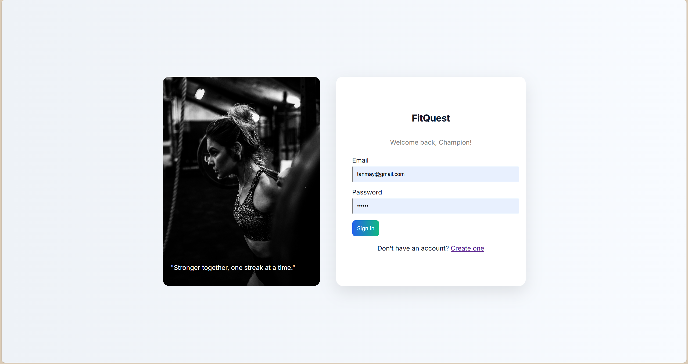

### 🏠 Dashboard


### 🏃 Challenges
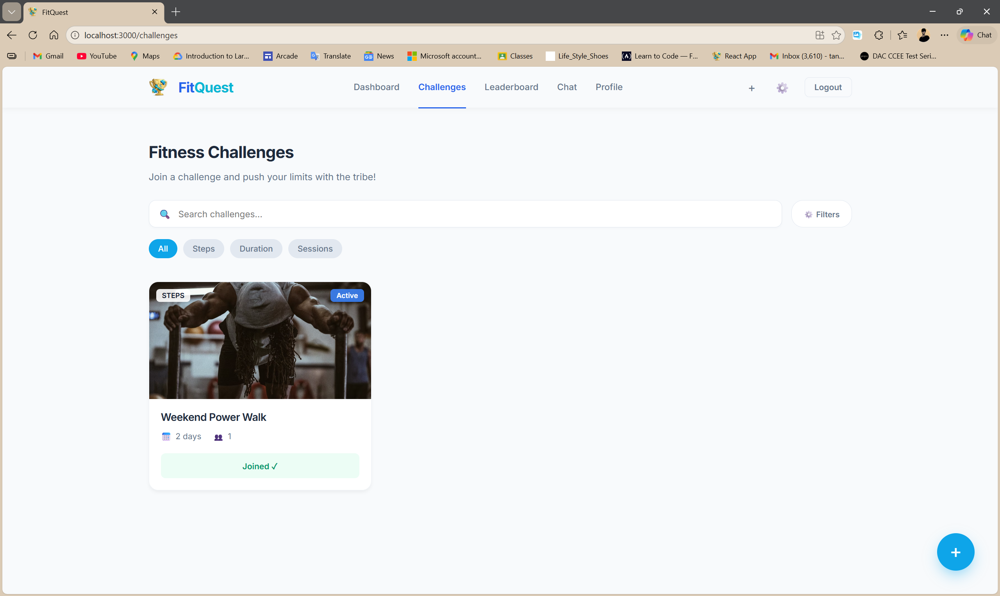

### 📋 Challenge Details
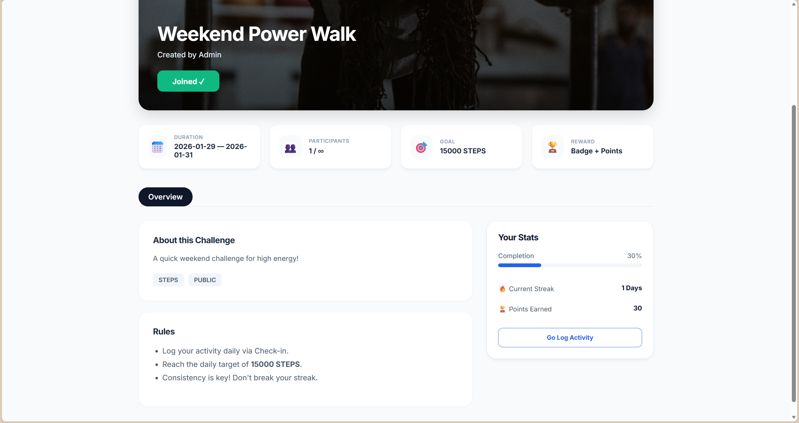

### ✅ Daily Check-in
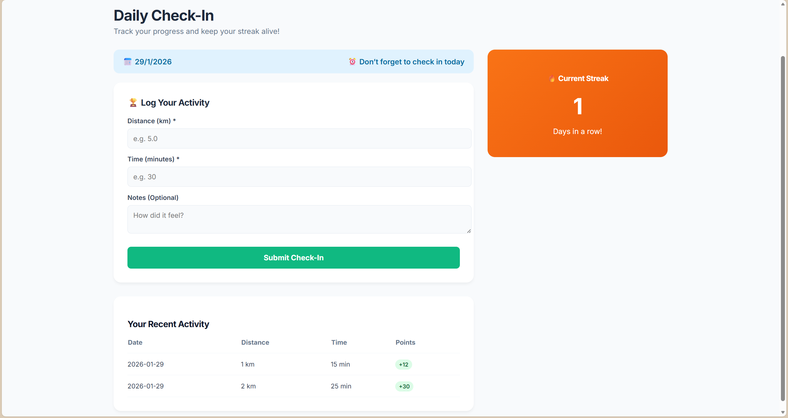

### 🏆 Leaderboard
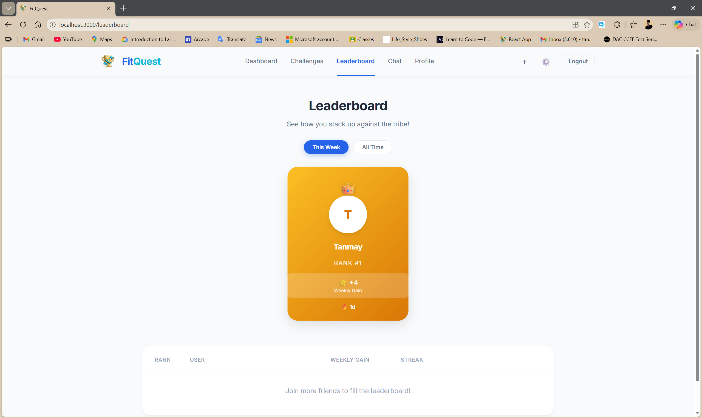

### 👤 Profile
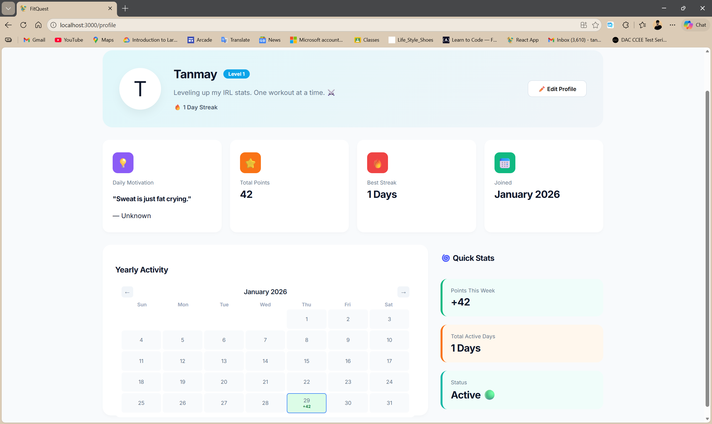

### ⚙️ Profile Settings
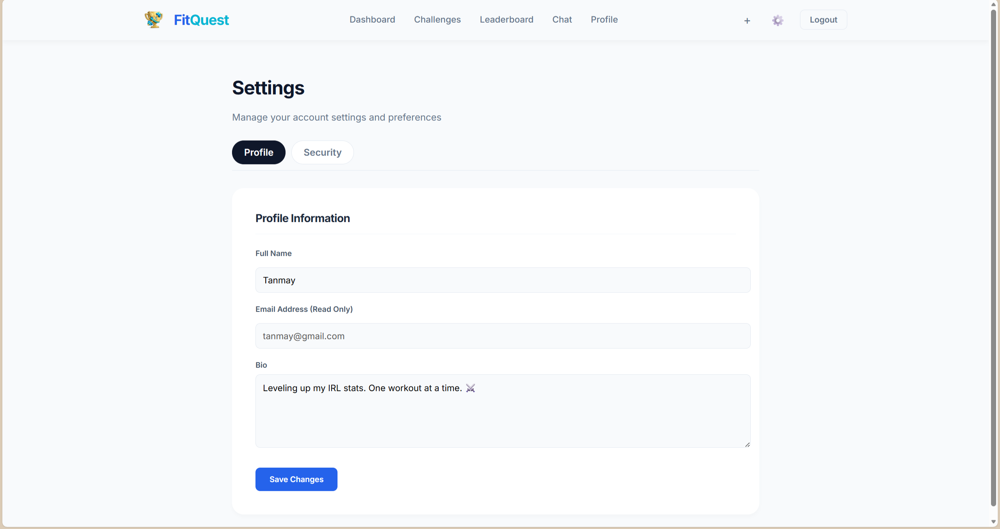

### 🔐 Security Settings
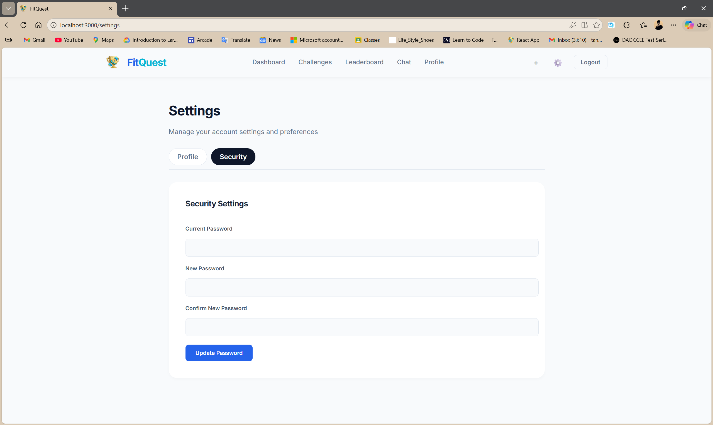

### 💬 Chat
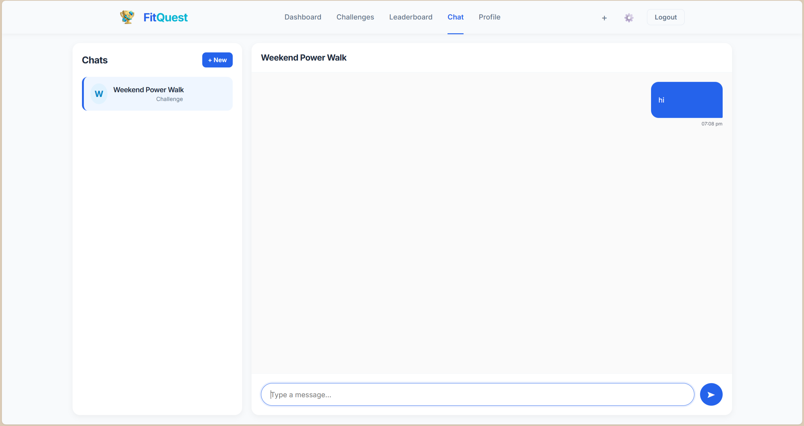

### ➕ Create Account
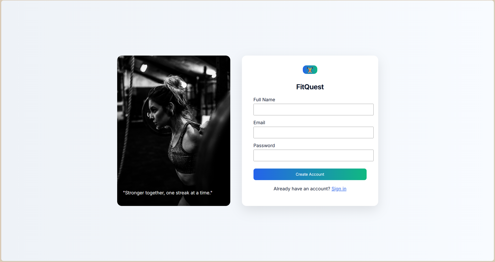

### ➕ Create Challenge
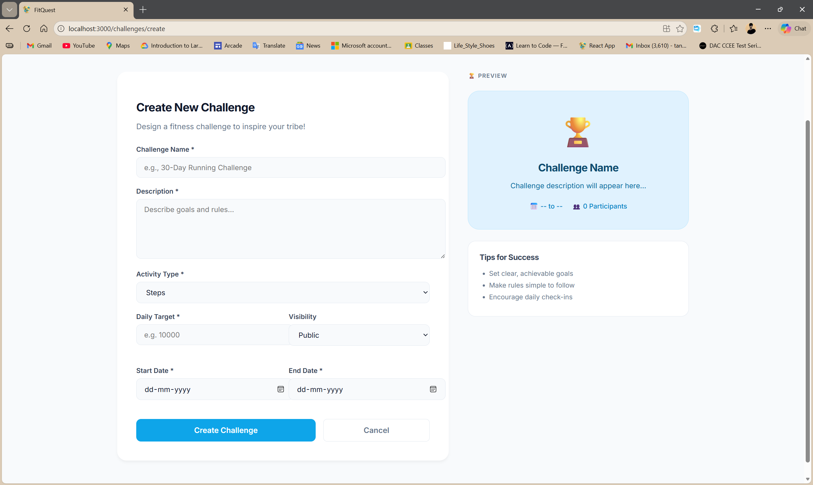

### ➕ Create Chat Group
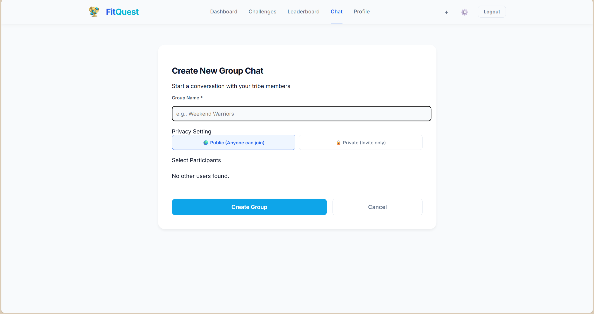

---

## ⚙️ Installation & Setup

### 1️⃣ Clone Repository

```bash
git clone https://github.com/tanmay-kaldate-26/FitQuest-Group-Fitness-Challenge-Gamified-Social-Platform.git
cd FitQuest-Group-Fitness-Challenge-Gamified-Social-Platform
```

### 2️⃣ Backend Setup

```bash
cd backend
# Run Spring Boot application
```

### 3️⃣ Frontend Setup

```bash
cd Frontend
npm install
npm start
```

### 4️⃣ Access Application

| Service | URL |
|--------|------|
| Frontend | http://localhost:3000 |
| Backend API | http://localhost:8080 |

---

## 🎯 Use Cases

- Individuals building fitness habits
- Groups competing in challenges
- Communities promoting healthy lifestyles
- Gamified habit-tracking platforms

---

## 🌍 Future Enhancements

- Mobile app (React Native / Flutter)
- AI-based fitness recommendations
- Wearable device integration
- Cloud deployment (AWS / Docker)
- Advanced analytics dashboard

---

## 💼 Resume-Ready Description

Developed a full-stack gamified fitness platform using React, Spring Boot, and MySQL, featuring user authentication, challenge management, daily activity tracking, streak calculation, leaderboards, and chat functionality. Designed RESTful APIs and relational database schema using Hibernate ORM to support scalable challenge participation and real-time ranking while following layered architecture and modular design principles.

---

## 👨‍💻 Author

**Tanmay Kaldate**  
GitHub: https://github.com/tanmay-kaldate-26  
LinkedIn: https://www.linkedin.com/in/tanmay-kaldate-044b3929a

---

## 📜 License

This project is licensed under the MIT License.